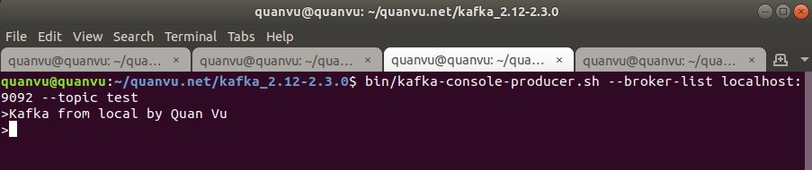
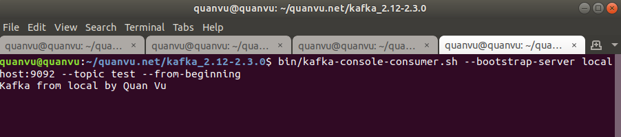

# kafka-flask-implementation

A simple demo for implement Kafka in Python Flask

## Start project

Start flask app with python3 virtual environtment

Create virtual environtment with python3

```shell
virtualenv -p python3 venv
source venv/bin/activate
pip install -r requirements.in
pip freeze > requirements.txt
```

Run App

Note: To make application works with Kafka we will run app with this command

```shell
python src/app.py
```

## Test it

Step 1: First do quickstart with Kafka.

Follows the [Kafka quickstart](https://kafka.apache.org/quickstart) to start Kafka Server [here](https://kafka.apache.org/quickstart). 

### Step 2: Start Flask app

```shell
python src/app.py
```

### Step 3: Run the Producer and send some messages to "test" topic

```shell
cd kafka_2.12-2.3.0
bin/kafka-console-producer.sh --broker-list localhost:9092 --topic test
> Kafka from local by Quan Vu
```

Producer



Consumer



### Step 4: Open Flask app terminal to see the result

```shell
* Serving Flask app "app" (lazy loading)
* Environment: production
WARNING: This is a development server. Do not use it in a production deployment.
Use a production WSGI server instead.
* Debug mode: on
* Running on http://127.0.0.1:5004/ (Press CTRL+C to quit)

# Kafka started success
[2019-12-29 11:44:25,963] [flask-kafka-consumer] [INFO]  * The flask Kafka application is consuming
[2019-12-29 11:44:25,964] [flask-kafka-consumer] [INFO] starting consumer...registered signterm
* Debugger is active!
* Debugger PIN: 105-402-809

# Kafka consume result
[2019-12-29 11:44:38,737] [flask-kafka-consumer] 

# Kafka topic info
[INFO] TOPIC: test, PAYLOAD: b'Kafka from local by Quan Vu'

# Kafka consume message: value=b'Kafka from local by Quan Vu'
consumed ConsumerRecord(topic='test', partition=0, offset=3, timestamp=1577594677727, timestamp_type=0, key=None, value=b'Kafka from local by Quan Vu', headers=[], checksum=None, serialized_key_size=-1, serialized_value_size=6, serialized_header_size=-1) from test topic
```

Enjoy it!